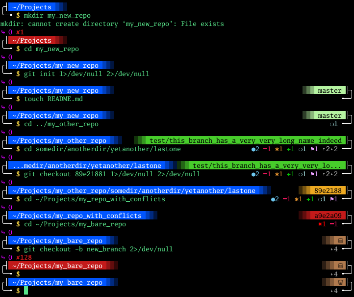

# Antares

`antares` is a theme for the `zsh` prompt that make use of colors to provide additional information to the user



## Table of content

- [Installation](#install)
  - [As zsh prompt theme](#prompt)
  - [As OhMyZsh theme](#ohmyzsh)
- [Customization](#customize)
  - [Customize the behavior](#behavior)
  - [Customize the colors](#colors)
  - [Customize the symbols](#symbols)
  - [Customize further](#others)
- [Tips](#tips)
  - [Updating](#updating)

## Install

The theme can be [installed as prompt theme](#prompt) or [added to oh-my-zsh themes](#ohmyzsh)

### Prompt

`zsh` loads themes from directories in `$fpath` at runtime. You can create a directory for custom themes in a `$HOME` path to have them available for a [user only](#user-only), or put themes in a system directory to have them available for [every user](#system-wide).

#### User only

The following step will assume that `$HOME/.local/share/zsh/functions/Prompts` is your directory of choice, but you can use any directory you wish.

Copy the theme:<br/>
```zsh
cp prompt_antares_setup "$HOME/.local/share/zsh/functions/Prompts"
```

Or create a symlink if you prefer:<br/>
```zsh
ln -s "$(pwd)/prompt_antares_setup" "$HOME/.local/share/zsh/functions/Prompts/prompt_antares_setup"
```

Add the directory to `$fpath` in `~/.zshrc`, if you didn't already:<br/>
```zsh
fpath=("$HOME/.local/share/zsh/functions/Prompts" "$fpath[@]")
```

Set `antares` as theme in `~/.zshrc`, **after** the point where the folder is added to `$fpath`:<br/>
```zsh
prompt antares
```

#### System-wide

The following step will assume that `/usr/share/zsh/functions/Prompts` is your directory of choice, but you can use any directory you wish (among the ones that are in `$fpath` by default).

Copy the theme:<br/>
```zsh
sudo cp prompt_antares_setup /usr/share/zsh/functions/Prompts
```

Or create a symlink if you prefer:<br/>
```zsh
sudo ln -s "$(pwd)/prompt_antares_setup" /usr/share/zsh/functions/Prompts/prompt_antares_setup
```

Set `antares` as theme in `~/.zshrc`:<br/>
```zsh
prompt antares
```

#### Troubleshooting

If you encounter this kind of error when launching the terminal<br>
`command not found: prompt`

You need to insert the following lines in `~/.zshrc`, **before** the point where you load the theme, but **after** the point where you add the custom folder to `$fpath` (if you chose the [user only](#user-only) method):<br/>
```zsh
autoload -Uz promptinit
promptinit
```

For example, the `.zshrc` file may look like this for a [system-wide](#system-wide) installation:<br/>
```zsh
autoload -Uz promptinit
promptinit
prompt antares
```

Or like this for a [user-only](#user-only) installation:<br/>
```zsh
fpath=("$HOME/.local/share/zsh/functions/Prompts" "$fpath[@]")
autoload -Uz promptinit
promptinit
prompt antares
```

#### Troubleshooting

If you see the `prompt` help message when launching the terminal

First check that the the folder where you installed the theme is actually in `$fpath`.

If you followed the [user only](#user-only) instructions, check for a typo in the path you inserted in the `.zshrc` file.<br/>
If everything seems fine, make sure that the theme is loaded **after** the point where the folder is added to `$fpath`.<br/>
For example, the `.zshrc` file may look like this:<br/>
```zsh
fpath=("$HOME/.local/share/zsh/functions/Prompts" "$fpath[@]")
prompt antares
```

### OhMyZsh

The following step will assume that `$HOME/.oh-my-zsh` is the place where `oh-my-zsh` is installed. If you have a custom installation path, just use it instead.

To have `antares` available in `oh-my-zsh`, you can either place it in `$HOME/.oh-my-zsh/themes` or `$HOME/.oh-my-zsh/custom/themes`. Assuming you chose to place it in `$HOME/.oh-my-zsh/themes`:<br/>
```zsh
cp antares.zsh-theme "$HOME/.oh-my-zsh/themes"
```

Edit `~/.zshrc` to have `antares` as theme:<br/>
```zsh
ZSH_THEME="antares"
```

## Customize

The theme can be customized by re-defining some variables in the `.zshrc` file, **after** the point where the theme is loaded.

### Behavior

Some aspects of the behavior can be customized with the following variables:

`ZSH_ANTARES_USE_OHMYZSH_GIT_PROMPT`

By default `antares` will use its own logic to gather information about a git directory, but this will cause a doubled performance overhead if `oh-my-zsh`'s `git-prompt` plugin is enabled.<br/>
For this reason, the builtin logic can be partially turned off by setting this variable to any value other than an empty string, so that `antares` will make use of `oh-my-zsh`'s `git-prompt` plugin to get information about a git directory.<br/>
For this to work correctly, the plugin must be enabled.

`ZSH_ANTARES_USE_LIGHT_GIT_MODE`

This option is only available when using the builtin git logic and will be ignored if `ZSH_ANTARES_USE_OHMYZSH_GIT_PROMPT` is enabled.<br/>
By setting this variable to any value other than an empty string, only basic information will be fetched from git.<br/>
This is particularly useful when working with huge repositories in order to have a performance boost. By the way, this option can also be enabled in order to reduce the amount of information displayed.

`ZSH_ANTARES_MIN_EXEC_TIME`

This option defines the minimum amount of time a command shall take to complete (in seconds) in order for the execution time to be displayed.<br/>
Setting this variable to a negative value disables the feature, so that execution time is never displayed.

### Colors

`antares` makes heavy use of colors, but not every terminal has the same color schemes, and not every user has the same taste about colors. For this reason, any element's color can be customized at will.

The color must be set as hex value, preceded by the hashtag character and enclosed in double quotes. For example:<br/>
`ZSH_ANTARES_FG_DECO="#f0f0f0"`

Variables' names are composed to be almost self-explanatory:
  - `ZSH_ANTARES` is the common prefix, you can ignore it
  - `FG` represents a foreground color
  - `BG` represents a background color
  - anything that follows indicates the element it applies to

The following is the list of all the available options for the colors:<br/>
`ZSH_ANTARES_FG_EXECTIME`<br/>
`ZSH_ANTARES_FG_ERRVAL`<br/>
`ZSH_ANTARES_FG_DECO`<br/>
`ZSH_ANTARES_FG_PWD_OK`<br/>
`ZSH_ANTARES_BG_PWD_OK`<br/>
`ZSH_ANTARES_FG_PWD_ERR`<br/>
`ZSH_ANTARES_BG_PWD_ERR`<br/>
`ZSH_ANTARES_FG_GIT_INIT`<br/>
`ZSH_ANTARES_BG_GIT_INIT`<br/>
`ZSH_ANTARES_FG_GIT_BARE`<br/>
`ZSH_ANTARES_BG_GIT_BARE`<br/>
`ZSH_ANTARES_FG_GIT_BRANCH`<br/>
`ZSH_ANTARES_BG_GIT_BRANCH`<br/>
`ZSH_ANTARES_FG_GIT_DETACH`<br/>
`ZSH_ANTARES_BG_GIT_DETACH`<br/>
`ZSH_ANTARES_FG_GIT_CONFLICT`<br/>
`ZSH_ANTARES_BG_GIT_CONFLICT`<br/>
`ZSH_ANTARES_FG_GIT_AHEAD`<br/>
`ZSH_ANTARES_FG_GIT_BEHIND`<br/>
`ZSH_ANTARES_FG_GIT_STAGED`<br/>
`ZSH_ANTARES_FG_GIT_ADDED`<br/>
`ZSH_ANTARES_FG_GIT_DELETED`<br/>
`ZSH_ANTARES_FG_GIT_CHANGED`<br/>
`ZSH_ANTARES_FG_GIT_CONFLICTS`<br/>
`ZSH_ANTARES_FG_GIT_UNTRACKED`<br/>
`ZSH_ANTARES_FG_GIT_STASHED`<br/>
`ZSH_ANTARES_FG_GIT_TAG`<br/>
`ZSH_ANTARES_FG_JOBS`<br/>
`ZSH_ANTARES_FG_PRIVILEDGES`

### Symbols

All the various symbols used can be replaced with custom symbols (or strings, if one really wants to...).

The only rule for the symbol is that it must be (composed of) a valid Unicode character(s), enclosed in double quotes. For example:<br/>
`ZSH_ANTARES_STR_ROOT="👽"`

Variables' names are composed to be almost self-explanatory, they basically follow the same rules as for colors' variables.

The following is the list of available options for the symbols:<br/>
`ZSH_ANTARES_STR_GIT_BARE`<br/>
`ZSH_ANTARES_STR_GIT_AHEAD`<br/>
`ZSH_ANTARES_STR_GIT_BEHIND`<br/>
`ZSH_ANTARES_STR_GIT_STAGED`<br/>
`ZSH_ANTARES_STR_GIT_ADDED`<br/>
`ZSH_ANTARES_STR_GIT_DELETED`<br/>
`ZSH_ANTARES_STR_GIT_CHANGED`<br/>
`ZSH_ANTARES_STR_GIT_CONFLICTS`<br/>
`ZSH_ANTARES_STR_GIT_UNTRACKED`<br/>
`ZSH_ANTARES_STR_GIT_STASHED`<br/>
`ZSH_ANTARES_STR_GIT_TAG`<br/>
`ZSH_ANTARES_STR_JOBS`<br/>
`ZSH_ANTARES_STR_ROOT`<br/>
`ZSH_ANTARES_STR_USER`

### Others

Further customization can be applied by editing the remaining variables:

`ZSH_ANTARES_PATHVAR`

The path expansion to use for the pwd, see the [zsh manual](https://zsh-manual.netlify.app/prompt-expansion) for available values

`ZLE_RPROMPT_INDENT`

This variable is part of `zsh` and will not apply to `antares` only, so use it with caution.<br/>
It defines the indentation of the right-side prompt. Namely, how many of spaces there will be between the right border of the terminal and the prompt.

## Tips

#### Updating

Keep the installed theme up-to-date by cloning this repo in a folder of your choice and use file linking instead of copying, so that at any time you can pull the latest updates in the repo folder and they will be reflected to the installed file by magic 🪄<br/>

